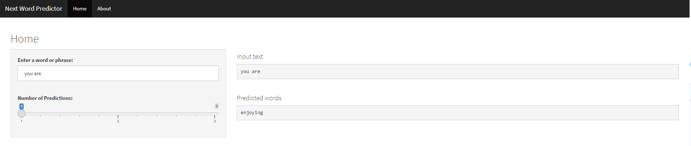

Next Word Predictor
========================================================
author: Surabh Regmi
date: February 16, 2022
autosize: true

This presentation features an application for predicting the next word.

Objective
========================================================

This presentation features the Next Word Predictor application built using Shiny. The application predicts the next word using n-gram (sequence of "n" words from a text) algorithm.

The Model
========================================================

Th text data used to create a frequency dictionary and thus to predict the next words comes from a corpus called [HC Corpora](http://www.corpora.heliohost.org/). Various R packages were used for text mining and natural language processing. The data was cleaned using **tm** package and **gsub** function. Cleaning involved changing text to lower case, removing non ASCII characters, URLS, email addressed, Twitter handles, hashtags, ordinal numbers, profanity, punctuations and whitespaces. The data was then tokenized into n-grams. 
The algorithm iterates from the longest n-gram to the shortest (4-gram to 2 gram) to detect a match. The predicted word is the one from the longest and most frequent n-gram match.

The User Interface
========================================================

The user can select from the from 1 to 3 most likely next words to be predicted using the available slider. The top most likely word will be shown followed by the second and third most likely words.
Once the user enters a word or a phrase, the input text and the predicted word are both displayed on the screen.

See screenshot of the application below:

Click on screenshot to go to the application

Additional Information
========================================================

* The next word prediction app is hosted on shinyapps.io: [ https://sregmi84.shinyapps.io/Next_Word_Predictor/]( https://sregmi84.shinyapps.io/Next_Word_Predictor/)

* The source code of this application can be found in this GitHub repo: [http://github.com/sregmi84/Data-Science-Capstone-Project](http://github.com/sregmi84/Data-Science-Capstone-Project)

* This pitch deck is located here: [http://rpubs.com/sregmi84/NextWordPredictor](http://rpubs.com/sregmi84/NextWordPredictor)
